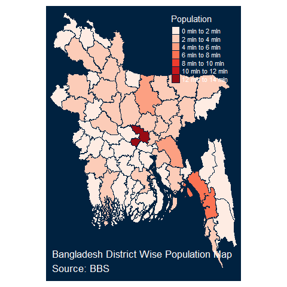
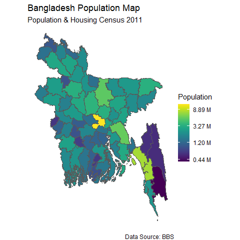
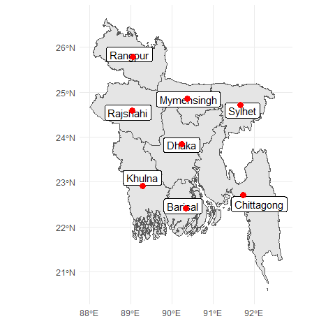
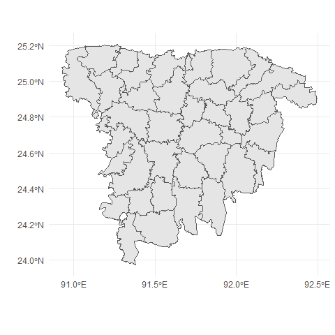
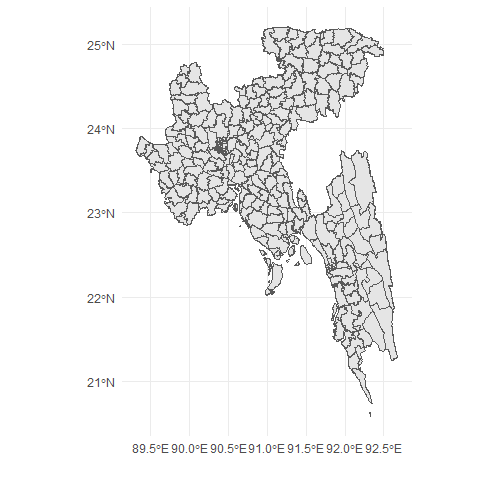
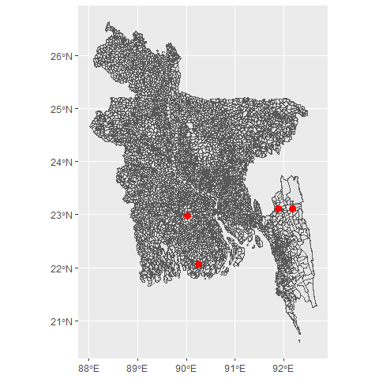

<!-- README.md is generated from README.Rmd. Please edit that file -->

The purpose of this package is to provide ready to use shapefiles for
different administrative regions of Bangladesh (e.g. Division, District,
Upazila, Union). Usually it is difficult to plot choropleth maps for
Bangladesh in R. This package will help users to draw thematic maps of
administrative regions of Bangladesh easily as it comes with the sf
objects for the boundaries and regions’ names in English. It also
provides some functions that allows users to easily get specific area
maps and to get center coordinates for regions. Users can also search
for a specific area and calculate the centroids of those areas.

## Getting Started

This packages comes with sf objects for administrative levels 0-4
(Country, Division, District, Upazilla, Union). Easiest way to get the
shapefile for a level is to is to use `get_map()` function.

``` r
# remotes::install_github("ovirahman/bangladesh")
library(bangladesh)

country <- get_map("country")
division <- get_map("division")
district <- get_map("district")
upazila <- get_map("upazila")
union <- get_map("union")
```

## Plotting Map

To start with we can check the sample function `bd_plot()` to draw the
map of different administrative levels of Bangladesh, that uses
[`tmap`](https://cran.r-project.org/web/packages/tmap/), which is a very
flexible and cool package to visulize thematic maps.

``` r
bd_plot("country")
```


``` r
bd_plot("division")
```


``` r
bd_plot("district")
```


We can also plot beautiful interactive maps with this.

## Choropleth map with data

My most favourite package for creating thematic maps is `tmap`. Using
this package we can make cool choropleths, both static and interactive.
When plotting mode is chosen as static (plot) it returns an `ggplot`
object, when interactive (view) it returns an
[`leaflet`](https://cran.r-project.org/web/packages/leaflet) object.

``` r
library(tmap)
population <- bangladesh::pop_district_2011[, c("district", "population")]
district <- get_map("district")

map_data <- dplyr::left_join(district, population, by = c("District" = "district"))

map <- tm_shape(map_data) + 
  tm_polygons("population",id = "District",palette = "Reds", title = "Population") +
  tm_style("cobalt")+
  tm_layout(
    "Bangladesh District Wise Population Map\nSource: BBS",
    title.position = c("left", "bottom"),
    legend.position = c("right", "top")
    )

tmap::tmap_mode("plot")
map
```



## Using ggplot2 and leaflet

We can also use `ggplot2` and `leaflet` to draw customized choropleths
with the sf objects provided in `bangladesh` package.

``` r
library(ggplot2)
ggplot(data = map_data) +
  geom_sf(aes(fill = population))+
  theme_void()+
  viridis::scale_fill_viridis(trans = "log", name="Population", labels = scales::unit_format(unit = "M", scale = 1e-6)) +
  labs(
    title = "Bangladesh Population Map",
    subtitle = "Population & Housing Census 2011",
    caption = "Data Source: BBS"
  )
```



## Other usefull functions

It is also possible to get the approximate center points (centroids) of
administrative regions easily

by using `get_coordinates()` function provided in `bangladesh` package.

``` r
division_map <- get_map("division")
division_centroids <- bangladesh::get_coordinates(level = "division")
knitr::kable(division_centroids, format = "html")
```

<table>
<thead>
<tr>
<th style="text-align:left;">
Division
</th>
<th style="text-align:right;">
lat
</th>
<th style="text-align:right;">
lon
</th>
</tr>
</thead>
<tbody>
<tr>
<td style="text-align:left;">
Barisal
</td>
<td style="text-align:right;">
22.41889
</td>
<td style="text-align:right;">
90.34684
</td>
</tr>
<tr>
<td style="text-align:left;">
Chittagong
</td>
<td style="text-align:right;">
22.70692
</td>
<td style="text-align:right;">
91.73546
</td>
</tr>
<tr>
<td style="text-align:left;">
Dhaka
</td>
<td style="text-align:right;">
23.83870
</td>
<td style="text-align:right;">
90.24064
</td>
</tr>
<tr>
<td style="text-align:left;">
Khulna
</td>
<td style="text-align:right;">
22.91367
</td>
<td style="text-align:right;">
89.29437
</td>
</tr>
<tr>
<td style="text-align:left;">
Mymensingh
</td>
<td style="text-align:right;">
24.84675
</td>
<td style="text-align:right;">
90.38088
</td>
</tr>
<tr>
<td style="text-align:left;">
Rajshahi
</td>
<td style="text-align:right;">
24.58846
</td>
<td style="text-align:right;">
89.04540
</td>
</tr>
<tr>
<td style="text-align:left;">
Rangpur
</td>
<td style="text-align:right;">
25.77920
</td>
<td style="text-align:right;">
89.05685
</td>
</tr>
<tr>
<td style="text-align:left;">
Sylhet
</td>
<td style="text-align:right;">
24.71515
</td>
<td style="text-align:right;">
91.66400
</td>
</tr>
</tbody>
</table>

``` r
ggplot(data = division_map) +
  geom_sf() +
  geom_sf_label(aes(label = Division)) +
  geom_point(data = division_centroids, x = division_centroids$lon, y = division_centroids$lat, col = "red", size = 3) +
  xlab("")+ ylab("")+
  theme_minimal()
```



Suppose someone needs to plot partially a single or selected number of
divisions instead of whole country map, in that case the function
`get_divisions()` might be benefitial.

``` r
sylhet <- get_divisions(divisions = "Sylhet",level =  "upazila")
# single division
ggplot(data = sylhet) +
  geom_sf() +
  xlab("")+ ylab("")+
  theme_minimal()
```



``` r
#multiple division
sylhet_chittagong_dhaka <- get_divisions(divisions = c("Sylhet", "Chittagong", "Dhaka"),level =  "upazila")
ggplot(data = sylhet_chittagong_dhaka) +
  geom_sf() +
  xlab("")+ ylab("")+
  theme_minimal()
```



To search for a area within the provided names for administrative
regions we can apply the `bd_search()` function. The result can also
include cecntroids for those areas.

``` r
amtali <- bd_search("amtali", level = "union", as.is = T, coordinates = T)
knitr::kable(amtali, format = "html")
```

<table>
<thead>
<tr>
<th style="text-align:left;">
Division
</th>
<th style="text-align:left;">
District
</th>
<th style="text-align:left;">
Upazila
</th>
<th style="text-align:left;">
Union
</th>
<th style="text-align:right;">
lat
</th>
<th style="text-align:right;">
lon
</th>
</tr>
</thead>
<tbody>
<tr>
<td style="text-align:left;">
Barisal
</td>
<td style="text-align:left;">
Barguna
</td>
<td style="text-align:left;">
Amtali
</td>
<td style="text-align:left;">
Amtali
</td>
<td style="text-align:right;">
22.07564
</td>
<td style="text-align:right;">
90.24704
</td>
</tr>
<tr>
<td style="text-align:left;">
Chittagong
</td>
<td style="text-align:left;">
Rangamati
</td>
<td style="text-align:left;">
Baghai Chhari
</td>
<td style="text-align:left;">
Amtali
</td>
<td style="text-align:right;">
23.10561
</td>
<td style="text-align:right;">
92.18835
</td>
</tr>
<tr>
<td style="text-align:left;">
Dhaka
</td>
<td style="text-align:left;">
Gopalganj
</td>
<td style="text-align:left;">
Kotali Para
</td>
<td style="text-align:left;">
Amtali
</td>
<td style="text-align:right;">
22.98264
</td>
<td style="text-align:right;">
90.03085
</td>
</tr>
<tr>
<td style="text-align:left;">
Chittagong
</td>
<td style="text-align:left;">
Khagrachhari
</td>
<td style="text-align:left;">
Matiranga
</td>
<td style="text-align:left;">
Amtali
</td>
<td style="text-align:right;">
23.11700
</td>
<td style="text-align:right;">
91.88539
</td>
</tr>
</tbody>
</table>

``` r
ggplot(bangladesh::map_union) +
  geom_sf() +
  geom_point(data = amtali, x = amtali$lon, y = amtali$lat, col = "red", size = 3) 
```


