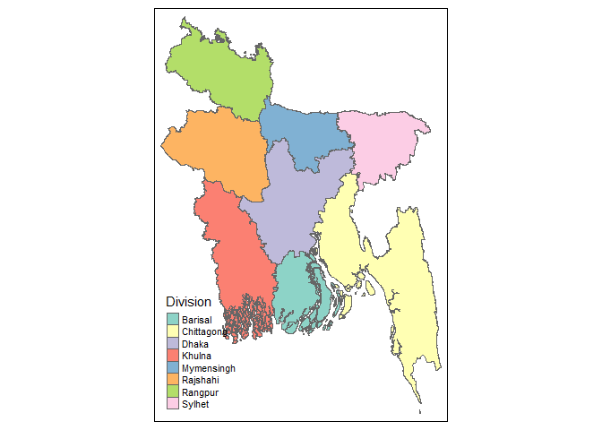

<!-- README.md is generated from README.Rmd. Please edit that file -->

# bangladesh

<!-- badges: start -->

<!-- badges: end -->

The goal of bangladesh is to provide ready to use shapefiles for
geographical map of Bangladesh

## Installation

## not yet uploaded to cran

You can install the released version of bangladesh from
[CRAN](https://CRAN.R-project.org) with:

``` r
install.packages("bangladesh")
```

And the development version from [GitHub](https://github.com/ovirahman)
with:

``` r
# install.packages("devtools")
devtools::install_github("ovirahman/bangladesh")
```

## Example

This is a basic example which shows you how to solve a common problem:

``` r
library(bangladesh)
## basic example code
bangladesh::bd_plot("division")
#> tmap mode set to plotting
```


